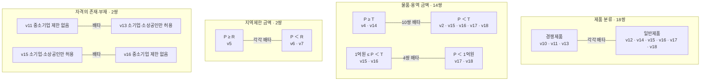

# 24개 feature의 상호 배타 관계

작성일: 2026-09-13 · 기준: 제공 항목표 2026-07-27 및 동봉 법령패키지

24개 feature의 서로 다른 두 항목 조합 276쌍을 검토했다. **같은 판정 대상과 사실관계를 전제하면 배타 36쌍, 지역제한 상한에 따라 달라지는 9쌍, 라벨 해석이 미확정인 1쌍, 나머지 배타 근거를 확인하지 못한 230쌍**이다. CJH의 v17/v18 배타 분류를 별도로 채택하면 배타 37쌍이 된다.

이 결과는 항목표의 적용범위와 법령의 조건에서 도출한 관계 분석이다. 법령이 대회 feature 번호 사이의 관계를 직접 규정하거나, 주최자가 공식 라벨 규칙을 확인해 준 것은 아니다. 개발 정답이나 예측 결과에서 동시 출현 빈도를 계산해 만든 규칙도 아니다.

## 해석의 단위

- 배타는 두 항목이 **동시에 1일 수 없음**을 뜻한다. 둘 다 0은 가능하다. 하나가 0이라고 다른 하나를 1로 바꾸는 관계가 아니다.
- 같은 구매 대상·세부품목 또는 분리된 계약/로트, 같은 금액 산정 범위, 같은 참가자격 적용 대상, 같은 문서 버전·시점을 비교한다. 가격의 사실관계와 법령상 예외 적용도 먼저 일치시킨다.
- 공고 하나에 경쟁제품 A와 일반제품 B가 포함되면 A에서 v10, B에서 v12가 각각 발생할 수 있다. 객체 단위의 배타를 공고 전체의 무조건적인 동시 1 금지로 바꿀 수 없다. 분리된 로트·공동수급 구성원별 자격에서도 같은 문제가 생긴다.
- 실제로는 둘 이상의 위법 요소가 함께 있어도 항목표의 금액 분기가 어느 feature로 분류할지를 정할 수 있다. 예를 들어 고시금액 미만의 특정기관 실적 요구가 위법하더라도, v4의 제목상 적용범위가 고시금액 이상이므로 v2와 v4를 구분한다.
- 일반제품은 해당 세부품명·규격·금액·예외를 반영하여 경쟁제품에 해당하지 않는 대상으로 사용한다. v14~v18의 ‘일반물품’은 연결 조문 제2조의2의 물품·용역 범위로 읽었다. 공식 채점 범위를 추가로 확인한 것은 아니다.

## 기호와 금액

| 기호 | 의미 |
|---|---|
| P | 동일 판정 대상의 추정가격. 예산·기초금액·부가세 포함 사업금액과 구별 |
| T | 국가계약법 제4조제1항에 따른 물품·용역 고시금액. 동봉 고시 제1호 가목은 **2억 3천만원** |
| R | 해당 계약의 지역제한 상한. 국가/지방, 공사/물품/용역, 기관 유형에 따라 정함 |
| E | 위의 동일 판정 단위와 본 보고서의 항목 해석에서 배타 |
| Q | 추가로 명시한 R과 T 또는 1억원의 관계가 충족될 때 배타 |
| U | 라벨 의미에 따라 달라지므로 배타로 확정하지 않음 |
| N | 검토한 정의·조문에서 고정적인 배타 관계를 확인하지 못함. 모든 구체적 사실관계의 동시 성립을 보장한다는 뜻은 아님 |

T는 FTA별 개방금액이나 공기업·준정부기관의 국제입찰 금액이 아니다. 지방의 실적 제한 및 일반제품 우선조달 조문 역시 국가계약법 제4조제1항의 금액을 참조한다. 반면 지방 지역제한은 지방계약법 시행규칙 제24조의 별도 기준을 따른다.

근거: [동봉 국가고시 제1호 가목](</home/hwajoong/projects/nara/data/법령패키지/법령/국가를 당사자로 하는 계약에 관한 법률 등의 재정경제부장관이 정하는 고시금액.txt:8>), [판로지원법 시행령 제2조의2](</home/hwajoong/projects/nara/data/법령패키지/법령/중소기업제품 구매촉진 및 판로지원에 관한 법률 시행령.txt:25>), [국가법령정보센터의 지방계약법 시행령 제20조](https://www.law.go.kr/LSW/lsLawLinkInfo.do?chrClsCd=010202&lsJoLnkSeq=900668366).

## 배타 36쌍의 관계도

아래 집합 사이의 선은 **왼쪽의 모든 항목과 오른쪽의 모든 항목 사이**의 배타를 뜻한다. 집합 안의 항목끼리는 선이 따로 없는 한 배타를 뜻하지 않는다. 여러 도표에 같은 feature가 반복되는 것은 서로 다른 배타 근거를 보여주기 위해서다.

| 배타 원인 | 모든 해당 쌍 | 수 | 근거 |
|---|---|---:|---|
| 경쟁제품과 일반제품 분류가 반대 | v10 ↔ v12, v14, v15, v16, v17, v18 | 6 | 항목표; 판로법 제7·9조; 경쟁제품 지정 고시·CSV·HWPX |
| 위와 같음 | v11 ↔ v12, v14, v15, v16, v17, v18 | 6 | 위와 같음 |
| 위와 같음 | v13 ↔ v12, v14, v15, v16, v17, v18 | 6 | 위와 같음; 판로법 제7조의2 특례 검토 |
| P < T 대 P ≥ T | v2 ↔ v4, v14 | 2 | 항목표의 v2·v4 범위; 국가규칙 제25조제2항; 지방령 제20조제1항제3·5호; 판로령 제2조의2 |
| P ≥ T 대 P < T | v4 ↔ v15, v16, v17, v18 | 4 | 위와 같음. v17·18은 P < 1억원 < T |
| 일반제품 금액 구간이 다름 | v14 ↔ v15, v16, v17, v18 | 4 | 판로령 제2조의2제1항제1·2호; 국가고시 제1호 가목 |
| 1억원 이상 대 미만 | v15 ↔ v17, v18; v16 ↔ v17, v18 | 4 | 판로령 제2조의2제1항제1·2호 |
| P ≥ R 대 P < R | v5 ↔ v6, v7 | 2 | 항목표의 금액 분기; 국가규칙 제24·25조; 지방규칙 제24·25조 |
| 중소기업 제한 부재 대 소기업만 허용 | v11 ↔ v13 | 1 | 중소기업기본법 제2조제2항; 소상공인기본법 제2조; 판로법 제7조 |
| 소기업만 허용 대 중소기업 제한 부재 | v15 ↔ v16 | 1 | 위 기업 포함관계; 판로령 제2조의2제1항제2호 |
| **합계** | 중복 없음 | **36** | |

v11/v13, v15/v16에서는 ‘중소기업 제한 없음’을 중기업을 포함한 전체 중소기업에 대한 개방 의무의 위반으로 읽지 않고, 중소기업 범주 밖을 배제하는 기업 규모 요건의 부재로 읽는다. **소상공인 ⊆ 소기업 ⊆ 중소기업**이므로 소기업만 참가시키는 자격은 좁기는 해도 중소기업 밖의 참가를 배제하는 자격이다. 따라서 ‘중소기업’이라는 단어가 없다는 이유만으로 부재탐지를 1로 만들면 안 된다.

기업 포함관계 원문: [중소기업기본법 제2조제2항](/home/hwajoong/projects/nara/data/법령패키지/법령/중소기업기본법.txt:19), [소상공인기본법 제2조](/home/hwajoong/projects/nara/data/법령패키지/법령/소상공인기본법.txt:12).

## 지역제한 상한에 따른 추가 9쌍

| 조건 | 추가 배타 쌍 | 수 | 증명 |
|---|---|---:|---|
| R ≥ T | v5 ↔ v2, v15, v16 | 3 | v5의 P ≥ R ≥ T와 상대 항목의 P < T가 모순 |
| R ≥ 1억원 | v5 ↔ v17, v18 | 2 | v5의 P ≥ R ≥ 1억원과 상대 항목의 P < 1억원이 모순 |
| R ≤ T | v6 ↔ v4, v14; v7 ↔ v4, v14 | 4 | v6·7의 P < R ≤ T와 상대 항목의 P ≥ T가 모순 |

조건이 확인되지 않으면 배타로 확정하지 않는다. 예컨대 **국가 물품·용역은 R=T=2.3억원**이므로 9쌍 모두 추가되어 **45쌍**이 된다. CJH의 v17/v18 배타 정의까지 채택하면 **46쌍**이다.

지방에서는 다음을 구별해야 한다.

| 지역제한 대상 | 동봉 자료의 R | 함의 |
|---|---|---|
| 지방 일반 물품·용역 중 시행규칙 제24조제2호나목의 5억원 적용 분기 | 5억원 | v4/v14와 v6/v7은 2.3억원 ≤ P < 5억원에서 금액 조건이 겹칠 수 있음 |
| 지방 건설기술·설계·공사감리·엔지니어링 기술용역 | 3.3억원 | R이 T보다 크므로 ‘고시금액’ 명칭만으로 동일 경계를 쓰면 안 됨 |
| 위 용역 중 안전점검·정밀안전진단 | 1.5억원 | R이 T보다 작음. 1.5억원 ≤ P < 2.3억원에서는 v2와 v5의 금액 조건이 함께 충족될 수 있음 |
| 지방 일반 물품·용역 중 행안부 고시금액 참조 분기 | 동봉 고시 원문 부재 | R을 미확정으로 남김. 국가 T나 공기업 금액으로 채우지 않음 |

마지막 표의 금액 겹침은 해당 feature의 나머지 위반요건까지 자동 충족한다는 뜻이 아니다. 건설기술·엔지니어링 등은 기업 규모 제한의 개별 적용범위·예외도 따로 확인한다. 공사에는 물품·용역 T=2.3억원을 사용하지 않는다.

원문: [국가규칙 제24조제2항](</home/hwajoong/projects/nara/data/법령패키지/법령/국가를 당사자로 하는 계약에 관한 법률 시행규칙.txt:227>), [지방규칙 제24조](</home/hwajoong/projects/nara/data/법령패키지/법령/지방자치단체를 당사자로 하는 계약에 관한 법률 시행규칙.txt:232>).

## v17/v18은 법령만으로 배타 라벨이라고 확정할 수 없음

법령상으로는 1억원 미만 일반 물품·용역에 소기업·소상공인 우선조달 의무가 있고, 자격업체 수·유찰 등에 따른 중소기업 확대 및 우선조달 예외가 있다. **그 의무 위반을 v17과 v18에 어떻게 나누어 기록할지는 별도의 라벨 정의 문제**다.

| 동일 공고의 상태: 예외 없는 1억원 미만 일반제품 | v17 | v18을 ‘소기업 제한이 없음’으로 넓게 해석 | v18을 ‘기업 규모 제한이 전혀 없음’으로 해석 |
|---|---:|---:|---:|
| 소기업·소상공인만 참가 | 0 | 0 | 0 |
| 중소기업 전체 참가, 중기업도 허용 | 1 | 1 | 0 |
| 기업 규모 제한 전혀 없음 | 0 | 1 | 1 |

- [원본 항목표](/home/hwajoong/projects/nara/data/항목표.json)는 v18을 ‘소기업 제한 없음’이라고 명명한다. 중소기업 전체 제한이 있는 경우 v18을 반드시 0으로 하라는 설명은 없다.
- [기존 법령기준 초안](/home/hwajoong/projects/nara/docs/reports/analysis/feature_legal_criteria_v1.md:257)은 v17/v18 동시 1을 허용한다.
- [CJH v17 카드](/home/hwajoong/projects/nara/user/CJH/판정카드(10~18)/v17.md:43)와 [v18 카드](/home/hwajoong/projects/nara/user/CJH/판정카드(10~18)/v18.md:44)는 기업 규모 제한이 전혀 없는 경우를 v18로 한정하여 v17/v18을 배타적으로 분류한다.

따라서 법령·원본 항목표에서 도출한 기본 36쌍에는 넣지 않고 U로 표시한다. CJH 카드 기준을 쓰는 경우에만 추가 1쌍으로 표시한다. 이 문제를 판로령 제2조의2의 조문만으로 해결했다고 주장하지 않는다.

## 배타로 잘못 묶기 쉬운 관계

아래 예시는 구조 설명을 위해 만든 사례이며 실제 데이터의 정답 사례가 아니다. 별도 언급이 없으면 적용 의무가 있고 예외는 없다고 가정한다.

| 쌍 또는 묶음 | 판단 | 이유·예시 |
|---|---|---|
| v2/v3 | 배타 근거 없음 | T 미만 제조·용역에서 2배 실적을 요구하면 저가 실적제한과 과도한 실적 규모가 함께 문제 될 수 있음. v3의 원래 제목에는 P ≥ T 한정이 없음 |
| v3/v4 | 동시 위반 가능 | T 이상에서 특정 공공기관의 2배 실적만 요구 |
| v1/v4 | 동시 위반 가능 | 참가 가능한 기관 유형 자체를 부당하게 제한하면서, T 이상 특정 발주기관 실적도 요구 |
| v2/v8, v3/v8, v4/v8 | 배타 근거 없음 | 실적의 금액·규모·종류 위반과 실적+지역의 중복제한 위반은 별도 축. 중복제한 허용 예외를 확인 |
| v5·v6·v7 각각과 v8 | 배타 근거 없음 | 해당 금액·지역 위반에 실적 참가자격을 추가할 수 있음 |
| v6/v7 | 고정 배타 아님 | 일반 지역제한경쟁에서 시·도 전체보다 좁은 A시와 다른 시·도의 B시만 임의로 묶으면 좁은 행정구역 제한과 부당한 인접 확대가 함께 문제 될 수 있음. 소액수의의 적법한 인접 시·군 확대는 양쪽 모두 자동 위반 아님 |
| v10/v11 | 동시 위반 가능 | 경쟁제품인데 직접생산 확인 요건과 중소기업 참가자격이 모두 누락 |
| v10/v13 | 동시 위반 가능 | 경쟁제품에서 직생 요건을 누락하면서 소기업만 부당하게 허용 |
| v12와 v14~v18 각각 | 동시 위반 가능 | 일반제품에 직생증명서를 부당하게 요구하면서 해당 금액대의 기업 규모 위반도 발생. 직생증명서 요구 자체를 곧 기업 규모 제한으로 간주하지 않음 |
| v9/v19 | 동시 위반 가능 | 특정 모델을 부당하게 강제하면서 제조사 확약서를 입찰 시 제출하도록 요구 |
| v10/v19, v12/v19 | 배타 근거 없음 | 직접생산확인증명서와 제조사 공급·기술지원확약서는 다른 문서·의무 |
| v20과 기업 규모 항목 | 고정 배타·함의 없음 | SW 참여제한 적용 여부·근거의 누락과 실제 기업 규모 참가범위는 다른 사실. SW 근거가 누락돼도 소기업 자격은 있을 수 있음. 반대로 법정 SW 참여제한은 v14 등의 적법 근거가 될 수 있어 실제 적용을 확인해야 함 |
| v21과 지역제한 항목 | 배타 근거 없음 | 공동수급 구성원의 최소지분, 지역업체 참여지분, 입찰참가자의 소재지 제한을 구별 |
| v22/v23 | 동시 위반 가능 | 지방 협상계약에서 설명회 참석을 강제하고 설명회 관련 기간도 부족하면 모두 1. 참석 선택/기간 부족은 0/1, 참석 강제/기간 충족은 1/0도 가능 |
| v24와 다른 모든 항목 | 고정 배타·함의 없음 | 문서·등록값 불일치는 법령 위반 여부와 별도. 어느 값을 사용했는지의 충돌은 원문을 보고 풀어야 하며 다른 위반이 있다는 이유로 v24를 1로 만들지 않음 |

v1, v3, v8, v9, v19, v20, v21, v22, v23, v24에는 위 E/Q/U 관계표에서 다른 항목과의 배타 연결이 없다. 이는 이 항목들이 위반을 만들 수 없거나 다른 항목과 전혀 관련 없다는 뜻이 아니다.

## 적용 전에 확인할 법령상 예외와 자료 한계

1. 경쟁제품의 소기업 제한은 판로법 제7조의2 특례 등 별도 근거가 있으면 v13 위반으로 단정하지 않는다. 일반제품도 판로령 제2조의2제1항제3호의 공동사업 제한 등 근거를 확인한다.
2. 판로령 제2조의3, 제7조의 예외는 적용요건 및 공고 기재/입력 여부를 확인한다. ‘연구’, ‘용역’이라는 이름만으로 예외가 되지 않는다.
3. 경쟁제품 분류에는 CSV의 번호뿐 아니라 HWPX 특이사항을 반영한다. 실제 확인한 616개 CSV 행 중 행사 관련 일부 품목은 10억원 미만, 축제기획및대행서비스는 3억원 미만이라는 지정 조건이 있다. SW 관련 품목은 소프트웨어 진흥법 제48조 적용 문구가 있다. 제품명이 같아도 판정 대상·금액·사업범위에 따라 분류나 적용 의무를 다시 확인해야 한다.
4. v3은 항목표의 ‘1배수 이상/사업예산’과 조문의 ‘1배 이내/추정가격’에 해석 차이가 남는다. 이 차이를 고시금액 이상의 조건으로 확대하여 v2/v3의 배타 규칙을 새로 만들지 않는다.
5. v20의 20·40·80억원은 부가세 포함 SW 사업금액이고 장기 유지관리에는 연평균 등이 적용된다. v2·v4·v14~18의 P 및 T와 동일 축이 아니다.
6. v21은 국가 공동이행 기본 10%, 지방 기본 5% 및 방식·조정 예외를 따로 확인한다. v22는 협상계약, v23은 지방 협상계약의 설명회 범위에 한정한다. 다른 방식에서 참석 강제를 허용하는 규정을 혼합하지 않는다.
7. 제공 문서가 누락되었거나 문서끼리 모순되면 ‘제한 있음/없음’을 확정하는 근거 자체가 불충분할 수 있다. 이때 두 비트만으로 어느 값을 고칠지 결정할 수 없다.

## 확인한 1차 자료

법령패키지 목록은 TXT 23개·CSV 1개·HWPX 1개다. 목록 전체와 관련 조문, 경쟁제품 표의 행 및 특이사항을 확인했다. 아래는 관계 판정에 직접 사용한 부분이며, 패키지에 수록된 모든 조항의 법률 적정성을 전수 검토했다는 뜻은 아니다. 각 원본의 SHA-256과 검토 범위는 별도 `source_inventory.json`에 기록했다.

| 자료 | 직접 확인한 부분 |
|---|---|
| 항목표.json | 24개 항목명·참고 조문·비고·부재탐지 여부 |
| 국가계약법 시행령 | 제12조, 제21조, 제43조 |
| 국가계약법 시행규칙 | 제17조, 제24조, 제25조 |
| 지방계약법 시행령 | 제13조, 제20조, 제35조, 제43조 |
| 지방계약법 시행규칙 | 제17조, 제24조, 제25조 |
| 정부 입찰·계약 집행기준 | 제5조, 제5조의3 |
| 지방자치단체 입찰 및 계약 집행기준 | 제1장 부당한 자격제한; 제4장 공급·기술지원확약; 제5장 소액수의 지역·실적 예외; 제6장 최소지분 |
| 국가 고시금액 | 제1호 가목 및 FTA·공기업 금액 구별 |
| 판로지원법 | 제7조, 제7조의2, 제8조의3, 제9조 |
| 판로지원법 시행령 | 제2조의2, 제2조의3, 제7조, 제10조 |
| 중소기업기본법·소상공인기본법 | 각각 제2조의 기업 범위 |
| 경쟁제품 지정 고시 TXT·CSV·HWPX | 지정 유효기간·분류 규정, 616개 세부품명 행 및 원본 특이사항 |
| 소프트웨어 진흥법·사업 참여 지원 지침 | 제48조, 지침 제2·3조·별표1 및 예외 연결 |
| 공동계약운용요령 | 제9조제5·6항 |
| 지방자치단체 입찰시 낙찰자 결정기준 | 제7장 제3절 공고 및 설명 시점 |

기존 판정카드는 해석 차이 확인을 위한 2차 자료로 취급했다. 공식 법령 대신 인용하지 않았으며 기존 코드·프롬프트·판정카드·정답 파일은 수정하지 않았다. 별도 온라인 대조는 국가법령정보센터의 지방계약법 시행령 제20조와 판로지원법 시행령의 시행정보를 확인하는 데 사용했고, 동봉하지 않은 지역 고시금액을 외부 수치로 채우지 않았다.

## 산출물

- `report.md`: 이 보고서. 아래에 24개 항목별 연결 목록과 24×24 행렬이 이어진다.
- `pairs.csv`: 276개 무순서 쌍 전체의 분류·조건·이유·근거 ID.
- `relations.json`: 동일 관계와 24개 feature 정의, 적용 전제 및 범례.
- `source_inventory.json`: 원본 목록·해시와 직접 확인 범위.

검산은 24개 항목, 중복 없는 276쌍, E36/Q9/U1/N230, 양방향 행렬 대칭 및 범주별 개수를 확인한다. 이 구조 검산은 법률 해석이나 대회 정답과의 일치를 검증한 실험이 아니다.

## 24개 항목별 연결 목록

E/Q/U 이외의 상대 항목은 N이다. Q의 성립 조건은 위 표 또는 pairs.csv를 따른다.

| 항목 | 원본 항목명 | E: 배타 상대 | Q: 조건부 상대 | U: 해석 미확정 |
|---|---|---|---|---|
| v1 | 참가자격 특정기관 제한 | — | — | — |
| v2 | 고시금액 미만 실적제한 | v4, v14 | v5 | — |
| v3 | 실적제한 1배수 이상 | — | — | — |
| v4 | 고시금액 이상 특정기관, 특정실적 | v2, v15, v16, v17, v18 | v6, v7 | — |
| v5 | 고시금액 이상 지역제한 | v6, v7 | v2, v15, v16, v17, v18 | — |
| v6 | 고시금액 미만 지역제한 시,군,구 | v5 | v4, v14 | — |
| v7 | 고시금액 미만 지역제한 인접 확대 | v5 | v4, v14 | — |
| v8 | 중복제한 (실적+지역) | — | — | — |
| v9 | 과업지시서 특정 모델명 명시 | — | — | — |
| v10 | 중기간 경쟁제품 입찰 직생 없음 | v12, v14, v15, v16, v17, v18 | — | — |
| v11 | 중기간 경쟁제품 입찰 중소 없음 | v12, v13, v14, v15, v16, v17, v18 | — | — |
| v12 | 일반제품 직생 제한 | v10, v11, v13 | — | — |
| v13 | 중기간 경쟁제품 소기업, 소상공인 제한 | v11, v12, v14, v15, v16, v17, v18 | — | — |
| v14 | 고시금액 이상 일반물품 중소기업 제한 | v2, v10, v11, v13, v15, v16, v17, v18 | v6, v7 | — |
| v15 | 1억 이상- 고시금액미만 소기업 제한 | v4, v10, v11, v13, v14, v16, v17, v18 | v5 | — |
| v16 | 1억 이상- 고시금액미만 중소기업 제한 없음 | v4, v10, v11, v13, v14, v15, v17, v18 | v5 | — |
| v17 | 1억원 미만 일반물품 중소기업 제한 | v4, v10, v11, v13, v14, v15, v16 | v5 | v18 |
| v18 | 1억원 미만 일반물품 소기업 제한 없음 | v4, v10, v11, v13, v14, v15, v16 | v5 | v17 |
| v19 | 물품공급 확약서 입찰 시 제출 | — | — | — |
| v20 | 입찰참가자격 (SW) | — | — | — |
| v21 | 공동 5% (10%) | — | — | — |
| v22 | 현장설명회 참석업체 (자격으로 제한 여부) * 계약방법 협상만 적용 | — | — | — |
| v23 | 현장설명회 (공고기간) * 계약방법 협상 + 계약법 지방만 적용 | — | — | — |
| v24 | 공고서와 나라장터 입력값 상이 | — | — | — |

## 전체 24×24 행렬

E=배타, Q=조건부, U=라벨 해석 미확정, ·=고정 배타 근거 미확인, —=자기 자신. 같은 정보의 쌍별 상세는 pairs.csv에 있다.

| |v1|v2|v3|v4|v5|v6|v7|v8|v9|v10|v11|v12|v13|v14|v15|v16|v17|v18|v19|v20|v21|v22|v23|v24|
|---|---|---|---|---|---|---|---|---|---|---|---|---|---|---|---|---|---|---|---|---|---|---|---|---|
|v1|—|·|·|·|·|·|·|·|·|·|·|·|·|·|·|·|·|·|·|·|·|·|·|·|
|v2|·|—|·|E|Q|·|·|·|·|·|·|·|·|E|·|·|·|·|·|·|·|·|·|·|
|v3|·|·|—|·|·|·|·|·|·|·|·|·|·|·|·|·|·|·|·|·|·|·|·|·|
|v4|·|E|·|—|·|Q|Q|·|·|·|·|·|·|·|E|E|E|E|·|·|·|·|·|·|
|v5|·|Q|·|·|—|E|E|·|·|·|·|·|·|·|Q|Q|Q|Q|·|·|·|·|·|·|
|v6|·|·|·|Q|E|—|·|·|·|·|·|·|·|Q|·|·|·|·|·|·|·|·|·|·|
|v7|·|·|·|Q|E|·|—|·|·|·|·|·|·|Q|·|·|·|·|·|·|·|·|·|·|
|v8|·|·|·|·|·|·|·|—|·|·|·|·|·|·|·|·|·|·|·|·|·|·|·|·|
|v9|·|·|·|·|·|·|·|·|—|·|·|·|·|·|·|·|·|·|·|·|·|·|·|·|
|v10|·|·|·|·|·|·|·|·|·|—|·|E|·|E|E|E|E|E|·|·|·|·|·|·|
|v11|·|·|·|·|·|·|·|·|·|·|—|E|E|E|E|E|E|E|·|·|·|·|·|·|
|v12|·|·|·|·|·|·|·|·|·|E|E|—|E|·|·|·|·|·|·|·|·|·|·|·|
|v13|·|·|·|·|·|·|·|·|·|·|E|E|—|E|E|E|E|E|·|·|·|·|·|·|
|v14|·|E|·|·|·|Q|Q|·|·|E|E|·|E|—|E|E|E|E|·|·|·|·|·|·|
|v15|·|·|·|E|Q|·|·|·|·|E|E|·|E|E|—|E|E|E|·|·|·|·|·|·|
|v16|·|·|·|E|Q|·|·|·|·|E|E|·|E|E|E|—|E|E|·|·|·|·|·|·|
|v17|·|·|·|E|Q|·|·|·|·|E|E|·|E|E|E|E|—|U|·|·|·|·|·|·|
|v18|·|·|·|E|Q|·|·|·|·|E|E|·|E|E|E|E|U|—|·|·|·|·|·|·|
|v19|·|·|·|·|·|·|·|·|·|·|·|·|·|·|·|·|·|·|—|·|·|·|·|·|
|v20|·|·|·|·|·|·|·|·|·|·|·|·|·|·|·|·|·|·|·|—|·|·|·|·|
|v21|·|·|·|·|·|·|·|·|·|·|·|·|·|·|·|·|·|·|·|·|—|·|·|·|
|v22|·|·|·|·|·|·|·|·|·|·|·|·|·|·|·|·|·|·|·|·|·|—|·|·|
|v23|·|·|·|·|·|·|·|·|·|·|·|·|·|·|·|·|·|·|·|·|·|·|—|·|
|v24|·|·|·|·|·|·|·|·|·|·|·|·|·|·|·|·|·|·|·|·|·|·|·|—|
